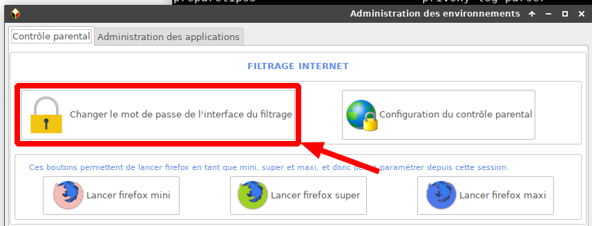
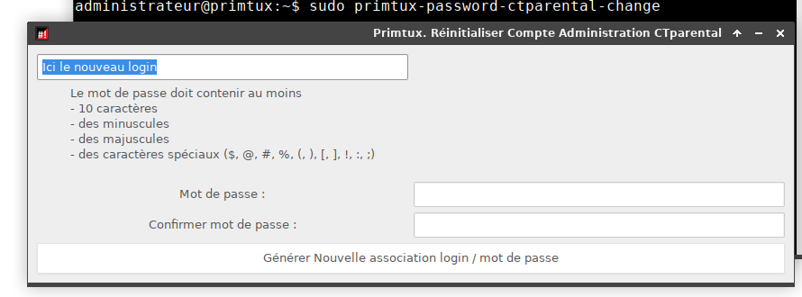

# primtux-perte-mot-de-passe-ctparental

## Késako
Interface GUI pour la modification du couple Admin / Password de CTParental

Et c'est tout ;)


## Installer le script

```
wget https://github.com/CyrilleBiot/primtux-perte-mot-de-passe-ctparental/raw/main/primtux-password-ctparental-change_1.8_all.deb
sudo primtux-password-ctparental-change
```

Mais le mieux serait de le coller sur ce bouton :



## Screenshoot


